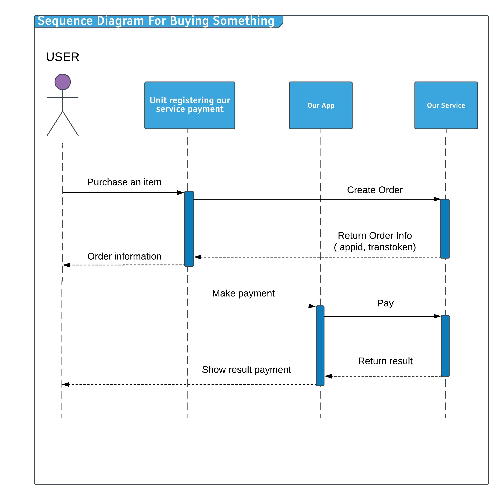

# Our Service :steam_locomotive::train::train::train::train::train:

## Table of Contents

- [Trello](#trello)
- [Server Git](#server-git)
- [Introduction](#introduction)
- [Technology](#technology)
- [Tool](#tool)
- [Features](#features)
- [Entity](#entity)
- [How To Use Amazon Server](#how-to-use-amazon-server)
- [Sequence Diagram](#sequence-diagram)
- [Task](#task)
- [Preferences](#preferences)
- [Development](#development)
- [Contributors](#contributors)

## Trello

Managing working flow
https://trello.com/b/f3TPEhEu/payment-app

## Server Git

https://github.com/lexuantien1997/Online_Payment_Server

## Introduction

An online payment app (client) using React native

## Technology
 | Package Name        | Description |
 | -------- |---|
 | __[React native](https://facebook.github.io/react-native/)__ | a JavaScript framework for writing real, natively rendering mobile applications for iOS and Android. |
 | __[React navigation](https://reactnavigation.org/)__ | provides an easy to use navigation solution, with the ability to present common stack navigation and tabbed navigation patterns on both iOS and Android. |
 | __[Redux](https://redux.js.org/)__| a predictable state container for JavaScript apps. Redux makes it easy to manage the state of your application. |
 | __[React native camera](https://github.com/react-native-community/react-native-camera)__ | the comprehensive camera module for React Native. In this app, it will handle scan QR code to pay money. |
 | __[Axios](https://github.com/axios/axios)__ | a Javascript library used to make HTTP requests from node.js or XMLHttpRequests. It is an upgraded version of fetch because it provides more options that fetch doesn't have |
 | __[Realm](https://realm.io/)__ | a mobile platform and a replacement for SQLite & Core Data. Build offline-first, reactive mobile experiences using simple data sync. Realm Database is a fast, easy to use, and open source.|
| __[Native base](https://github.com/GeekyAnts/NativeBase)__ | an open source framework to build React Native apps over a single JavaScript codebase for Android and iOS.|
| __[React Native Swiper](https://github.com/leecade/react-native-swiper)__ | The best Swiper component for React Native. (This will show promotion)|
| __[React Native Vector Icons](https://github.com/oblador/react-native-vector-icons)__ | Customizable Icons for React Native with support for NavBar/TabBar/ToolbarAndroid, image source and full styling.|

- __[Nodejs](https://nodejs.org/en/) :__ Node.js is an open-source, cross-platform JavaScript run-time environment that executes JavaScript code outside of a browser.
- __[Reactjs](https://reactjs.org/) :__  In computing, React is a JavaScript library for building user interfaces. It is maintained by Facebook and a community of individual developers and companies. React can be used as a base in the development of single-page or mobile applications.
- __[MongoDB](https://www.mongodb.com/) :__ MongoDB Inc. is an American software company that develops and provides commercial support for the open source database MongoDB, a NoSQL database that stores data in JSON-like documents with flexible schemas. [How to use mongo at local] (https://www.youtube.com/watch?v=bDcWAedlsrs&list=PLzrVYRai0riQRst_vFmvBIQoViblgdvLf)
- __[Lerna](https://lernajs.io/) :__ A tool for managing JavaScript projects with multiple packages.

## Tool

1. Any editors

## Features

1. Handle request from mobile app
    - Trasnfer money from 2 users
    - Pay an order from QR code
2. Manage transactions
    - User
    - Agent

## Entity

| Name     |      Role |
|----------|:-------------:|
| Admin     |Represent for an admin who manage directly server |
| User     |Represent for an user |
| Agent    |Represent for an agent|
| Transaction | Represent for a transaction ( such as: user - user, user - agent )     |

## How To Use Amazon Server

1. Login into Amazon cloud 9
2. Go to enviroment and run **npm run dev**
    - Remarkable: server **only** run at port 8080, client **only** run at port 8081.
    
## Task

- [ ] Adapt with nodejs enviroments along with tools. ( Make a branch and test it :+1:)
- [ ] Design a database
- [ ] ...

## Sequence Diagram

## Preferences

- [Quy trình xử lí của zalopay](https://developers.zalopay.vn/docs/webtoapp/index.html#t-ng-quan)

## Development

### System Description Document

*System specification document (simple) such as data flow diagrams of components or screens, relationship of entities, contracts API, etc.*

Detail: [system-description-document.md](./development/system-description-document.md)

### Pro tips

*Take note of the issues encountered during application development, and how to solve problems.*

Detail: [pro-tips.md](./development/pro-tips.md)

## Contributors

- **Hứa Vĩ Trung : 15520940**
- **Lê Xuân Tiến : 15520884**
- **Huỳnh Minh Tân : 15520763**
