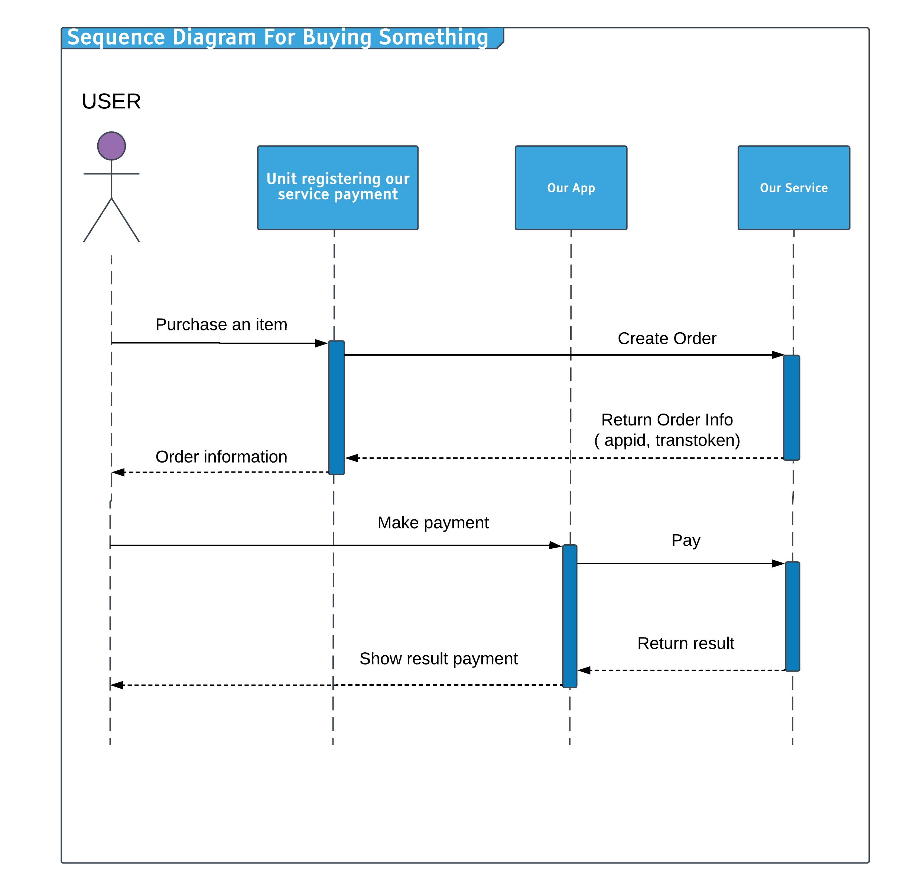

# Our Service :steam_locomotive::train::train::train::train::train:

## Table of Contents

- [Introduction](#introduction)
- [Technology](#technology)
- [Tool](#tool)
- [Features](#features)
- [Entity](#entity)
- [Sequence Diagram](#sequence-diagram)
- [Task](#task)
- [Preferences](#preferences)
- [Contributors](#contributors)

## Introduction

The server handle request from payment app and manage transactions

## Technology

- __[Nodejs](https://nodejs.org/en/) :__ Node.js is an open-source, cross-platform JavaScript run-time environment that executes JavaScript code outside of a browser.
- __[Reactjs](https://reactjs.org/) :__  In computing, React is a JavaScript library for building user interfaces. It is maintained by Facebook and a community of individual developers and companies. React can be used as a base in the development of single-page or mobile applications.
- __[React Native](https://facebook.github.io/react-native/) :__ React Native lets you build mobile apps using only JavaScript. It uses the same design as React, letting you compose a rich mobile UI from declarative components.
- __[MongoDB](https://www.mongodb.com/) :__ MongoDB Inc. is an American software company that develops and provides commercial support for the open source database MongoDB, a NoSQL database that stores data in JSON-like documents with flexible schemas. [How to use mongo at local] (https://www.youtube.com/watch?v=bDcWAedlsrs&list=PLzrVYRai0riQRst_vFmvBIQoViblgdvLf)
- __[Lerna](https://lernajs.io/) :__ A tool for managing JavaScript projects with multiple packages.
## Tool
1. Any editors

## Features

1. Handle request from mobile app
   -  Trasnfer money from 2 users
   -  Pay an order from QR code
2. Manage transactions
   -  User
   -  Agent

## Entity
| Name     |      Role |
|----------|:-------------:|
| Admin     |Represent for an admin who manage directly server |
| User     |Represent for an user |
| Agent    |Represent for an agent|
| Transaction | Represent for a transaction ( such as: user - user, user - agent )     |

## Task

- [ ] Adapt with nodejs enviroments along with tools. ( Make a branch and test it :+1:)
- [ ] Design a database
- [ ] ...

## Sequence Diagram

## Preferences
  - [Quy trình xử lí của zalopay](https://developers.zalopay.vn/docs/webtoapp/index.html#t-ng-quan)

  ## Contributors

- **Hứa Vĩ Trung : 15520940**
- **Lê Xuân Tiến : 15520884**
- **Huỳnh Minh Tân : 15520763**
